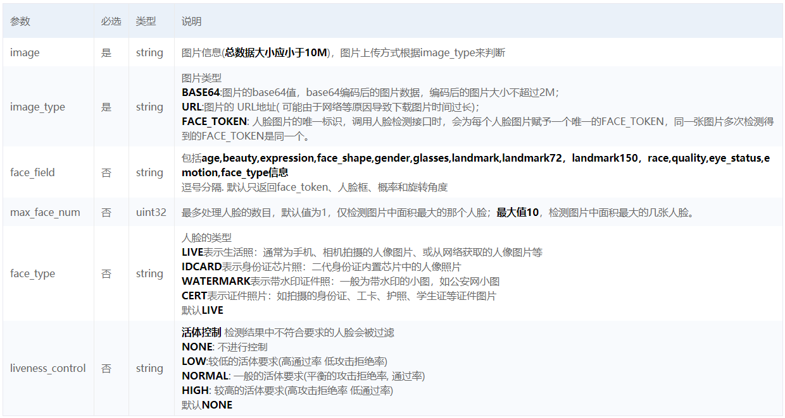
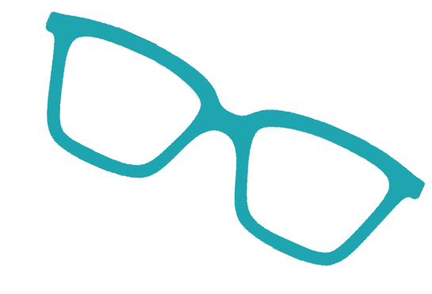
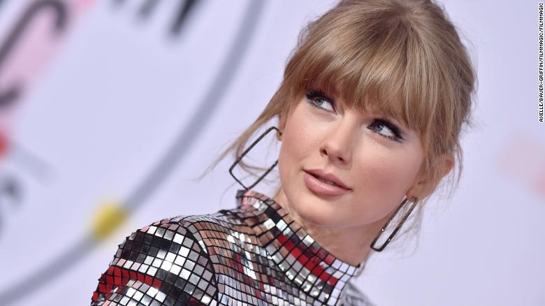
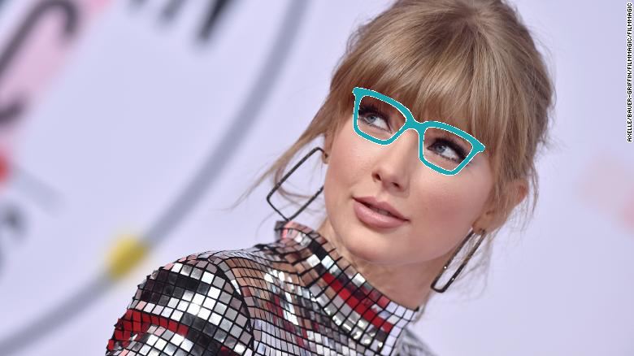

# 给人脸戴眼镜

本项目主要使用的 API 是人脸关键点检测。因为给人脸加眼镜特效其实只需要眼睛相关的关键点即可，所以本项目为了简单，使用的是百度 AI 人脸检测 API 中的 landmark4（左眼中心、右眼中心、鼻尖、嘴中心），所以也不算是一个新品体验吧。但是呢可以在更多的关键点上加更多的特效，等后期有时间再完善吧。

本项目主要基于 python3 实现。

## 人脸检测与属性分析 API 介绍

本部分参考自官方文档，更多细节参考 [http://ai.baidu.com/docs#/Face-Detect-V3/top](http://ai.baidu.com/docs#/Face-Detect-V3/top)

### 接口能力

* 人脸检测：检测图片中的人脸并标记出位置信息;
* 人脸关键点：展示人脸的核心关键点信息，及150个关键点信息。
* 人脸属性值：展示人脸属性信息，如年龄、性别等。
* 人脸质量信息：返回人脸各部分的遮挡、光照、模糊、完整度、置信度等信息。

### 请求参数



* **max_face_num**: 为了能够检测多个人脸，这个参数最好设置为 10；
* **image**: 图像信息，依据 image_type 不同而不同；
* **image_type**: (BASE64, image 为图片的 base64 编码), (URL, image 为图片的URL地址)，(FACE_TOKEN, image 为一个唯一的标志)
* **face_field**：包括（age, beauty, expression, face_shape,gender, glasses, landmark, landmark72, landmark150, race,quality, eye_status, emotion, face_type），可以根据具体需求进行设置。

其他两个参数保持默认就行，若是有特殊需要，也可进行修改。

如果 `image_type` 设置为 `BASE64`，则图像需要进行 `base64` 编码，python3 中 `base64` 编码的具体代码如下：

```python
import base64

def pic_base64(image_path):
    with open(image_path, 'rb') as f:
        base64_data = base64.b64encode(f.read())
    return base64_data
```

输出的 `base64_data` 的 `type` 为 `<class 'bytes'>`。

### 返回参数

根据 `face_field` 的不同返回的结果不同。具体的返回结果参数及描述参见 [http://ai.baidu.com/docs#/Face-Detect-V3/top](http://ai.baidu.com/docs#/Face-Detect-V3/top) 。接下来对不同的 `face_field` 进行讨论。

#### 默认返回字段

默认情况下，即不论 `face_field` 为什么，都一定会输出的字段。这些字段包括 `angle`, `face_probability`, `face_token` 和 `location`，分别代表人脸在三维中的角度，人脸置信度，人脸图片的唯一标识和人脸在框。其中一个输出样例如下：

```python
{'face_list': [{'angle': {'pitch': 9.28, 'roll': 20.87, 'yaw': 5.92},
                'face_probability': 1,
                'face_token': 'a8b2a513ffa1f726ec15818d81583861',
                'location': {'height': 198,
                             'left': 436.45,
                             'rotation': 24,
                             'top': 98.36,
                             'width': 214}}],
 'face_num': 1}
```

#### 其他返回字段

> 注：以下展示的返回不包括上面的四个默认字段，但是这四个字段是一定会返回的。

* `face_field` 包含 age 时，代表年龄，返回包含 `'face_list': [{'age': 25}]`
* `face_field` 包含 beauty 时，代表美丑打分，返回包含 `'face_list': [{'beauty': 63.9,}]`
* `face_field` 包含 expression 时，代表表情，返回包含 `'face_list': [{'expression': {'probability': 0.64, 'type': 'none'},}]`
* `face_field` 包含 face_shape 时，代表脸型，返回包含 `'face_list': [{'face_shape': {'probability': 0.44, 'type': 'oval'},}]`
* `face_field` 包含 gender 时，代表性别，返回包含 `'face_list': [{'gender': {'probability': 1, 'type': 'female'},}]`
* `face_field` 包含 glasses 时，代表是否带眼镜，返回包含 `'face_list': [{'glasses': {'probability': 1, 'type': 'none'},}]`
* `face_field` 包含 landmark 时，会返回 4 点 landmark 和 72 点 landmark，

```
face_list': [{'landmark': [{'x': 465.13, 'y': 146.17},
                           {'x': 550.82, 'y': 184.07},
                           {'x': 481.01, 'y': 212.33},
                           {'x': 464.83, 'y': 260.26}],
            'landmark72': [{'x': 422.01, 'y': 130.14},
                           {'x': 410.94, 'y': 158.96},
                           {'x': 403.67, 'y': 189.87},
                                        .
                                        .
                                        .
                           {'x': 462.4, 'y': 263.8},
                           {'x': 447.01, 'y': 254.79}],}]
```

* `face_field` 包含 landmark72 时，竟然没有对应的返回值，这可能是个 ~~bug~~。
* `face_field` 包含 landmark150 时，返回对应 150 个关键点，

```
'face_list': [{'landmark150': {'cheek_left_1': {'x': 623.08, 'y': 219.69},
                               'cheek_left_10': {'x': 497.4, 'y': 323.65},
                                                 .
                                                 .
                                                 .
                               'nose_tip': {'x': 477.8, 'y': 210.79}},}]
 ```
 
* `face_field` 包含 race 时，代表人种，返回包含 `'face_list': [{'race': {'probability': 1, 'type': 'white'}}],}]`
* `face_field` 包含 quality 时，代表人脸质量信息，返回包含

```
'face_list': [{'quality': {'blur': 0,
                           'completeness': 1,
                           'illumination': 157,
                           'occlusion': {'chin_contour': 0,
                                         'left_cheek': 0.1,
                                         'left_eye': 0.59,
                                         'mouth': 0,
                                         'nose': 0,
                                         'right_cheek': 0.02,
                                         'right_eye': 0.33}}}]
```
* `face_field` 包含 eye_status 时，代表双眼状态（睁开/闭合），返回包含 `'face_list': [{'eye_status': {'left_eye': 1, 'right_eye': 1},}]`
* `face_field` 包含 emotion 时，代表情绪，返回包含 `'face_list': [{'emotion': {'probability': 0.71, 'type': 'happy'},}]`
* `face_field` 包含 face_type 时，代表真实人脸/卡通人脸，返回包含 `'face_list': [{'face_type': {'probability': 0.98, 'type': 'human'},}]`

关于人脸关键点的更多信息参考 [http://ai.baidu.com/docs#/Face-Detect-V3/top](http://ai.baidu.com/docs#/Face-Detect-V3/top)

## 利用关键点实现戴眼镜特效

### 获取 access_token

要调用百度 AI API 的接口，需要创建对应的应用并获取 access_token.

#### 创建应用

首先登陆百度 AI 控制台（[https://console.bce.baidu.com/?fromai=1#/aip/overview](https://console.bce.baidu.com/?fromai=1#/aip/overview)），然后点击右侧导航栏里面的 “人脸识别”。


然后点击创建应用，好像有些接口在 V3 版本中才有，具体的参考文档。


填好“应用名称”和“应用描述”后点击“创建应用”。


创建好应用之后，进入“应用列表”，就能看到应用的相关信息，我们需要的是 `API Key` 和 `Secret Key`。


#### 获取 access token

通过 `API Key` 和 `Secret Key` 获取的 `access_token`。更多关于 `access_token` 的获取方法参考 [http://ai.baidu.com/docs#/Auth/top](http://ai.baidu.com/docs#/Auth/top)。

下面代码是 python3 获取 access_token 的代码

```python
from urllib.request import urlopen, Request
import json

def get_token_key():
    token_key = ''
    client_id = '填写上面获取的 API key'  # API key
    client_secret = '填写上面获取的 Secret key'  # Secret key

    host = f'https://aip.baidubce.com/oauth/2.0/token?grant_type=client_credentials' \
        f'&client_id={client_id}&client_secret={client_secret}'

    request = Request(host)
    request.add_header('Content-Type', 'application/json; charset=UTF-8')
    response = urlopen(request)
    token_content = response.read()
    if token_content:
        token_info = json.loads(token_content)
        token_key = token_info['access_token']
    return token_key
```

### 调用人脸检测接口

调用人脸检测接口的 python3 实现代码如下：

```python
from urllib.request import urlopen, Request
import json

def get_face_info(image_base64, token_key):
    request_url = "https://aip.baidubce.com/rest/2.0/face/v3/detect"
    params_d = dict()
    params_d['image'] = str(image_base64, encoding='utf-8')
    params_d['image_type'] = 'BASE64'
    params_d['face_field'] = 'landmark'
    params_d['max_face_num'] = 10
    params = json.dumps(params_d).encode('utf-8')
    access_token = token_key
    request_url = request_url + "?access_token=" + access_token
    request = Request(url=request_url, data=params)
    request.add_header('Content-Type', 'application/json')
    response = urlopen(request)
    content = response.read()
    if content:
        data = json.loads(content)
        assert data['error_code'] == 0, data
        # pprint(data)
        return data['result']
```

这里将具体的几个字段直接通过字符串指定在函数内，你也可以通过传递参数来实现。注意，该函数参数 `image_base64` 的 type 为 `byte`，需要转换为 `str` 才能序列化为 json。通过指定不同的 `face_field` 值能够得到前面说明的返回字段，该项目只需要使用人脸关键点，并且使用的是 4 个人脸关键点，所以指定 `face_field` 为 `landmrak`。

得到返回结果后，我们还需要将人脸关键点结构化，下面是 python3 获取 landmark 的代码：

```python
def get_face_num(data):
    return data['face_num']
    

def get_landmark4(data):
    landmarks = list()
    face_num = get_face_num(data)
    for i in range(face_num):
        landmark = list()
        for j in range(4):
            x = data['face_list'][i]['landmark'][j]['x']
            y = data['face_list'][i]['landmark'][j]['y']
            landmark.append(list(map(int, (x, y))))
        landmarks.append(landmark)
    return landmarks
```

因为可能一张图像中含有多个人脸，因此需要对每个人脸的关键点进行结构化。

4个关键点位置分别为左眼中心、右眼中心、鼻尖、嘴中心，我们只需要左眼中心和右眼中心，即 landmark[0] 和 landmark[1]。

### 加眼镜特效

首先通过两个坐标点（左眼中心、右眼中心）可以计算出两点所在直线相对于水平线的夹角，同时可以计算出两点之间的距离。

```python
lmk0 = np.array(landmark[0])  # right eye center
lmk1 = np.array(landmark[1])  # left eye center
# for j in range(len(landmark))[:2]:
#     cv2.circle(image, (landmark[j][0], landmark[j][1]), 1, (0, 255, 0), 2)

glasses_center = np.mean([lmk0, lmk1], axis=0)  # the center of glasses mask
glasses_size = np.linalg.norm(lmk0 - lmk1) * 2  # the width of glasses mask
angle = -util.angle_between(lmk0, lmk1)
```

这里认为两点间线段的中点坐标为需要带上的眼镜图像（glasses mask）的中心，将线段间的距离的2倍认为是需要带上眼镜图像的宽（width，带有一定角度）。

然后我们这里默认输入的眼镜图像是透明的（png）和水平的，例如


下面代码将水平的眼镜进行旋转，并获得旋转矩阵。

```python
glasses_h, glasses_w = glasses.shape[:2]
glasses_c = (glasses_w / 2, glasses_h / 2)
M = cv2.getRotationMatrix2D(glasses_c, angle, 1)
cos = np.abs(M[0, 0])
sin = np.abs(M[0, 1])

# compute the new bounding dimensions of the image
nW = int((glasses_h * sin) + (glasses_w * cos))
nH = int((glasses_h * cos) + (glasses_w * sin))

# adjust the rotation matrix to take into account translation
M[0, 2] += (nW / 2) - glasses_c[0]
M[1, 2] += (nH / 2) - glasses_c[1]

rotated_glasses = cv2.warpAffine(glasses, M, (nW, nH))
```

这段代码也可以直接使用 `rotated_glasses = imutils.rotate_bound(glasses, -angle)` 来替换，不过需要安装 imutils，关于该函数和该库的说明可以参见 [https://blog.csdn.net/u011511601/article/details/79529318](https://blog.csdn.net/u011511601/article/details/79529318)

比如一个旋转一定角度的眼镜图像为



然后将旋转后的眼镜图像与人脸图像在指定的眼镜 mask 区域进行融合，融合代码如下：

```python
def overlay_transparent(background_img, img_to_overlay_t, x, y, overlay_size=None):
    bg_img = background_img.copy()
    # convert 3 channels to 4 channels
    if bg_img.shape[2] == 3:
        bg_img = cv2.cvtColor(bg_img, cv2.COLOR_BGR2BGRA)

    if overlay_size is not None:
        img_to_overlay_t = cv2.resize(img_to_overlay_t.copy(), overlay_size)

    b, g, r, a = cv2.split(img_to_overlay_t)

    mask = cv2.medianBlur(a, 5)

    h, w, _ = img_to_overlay_t.shape
    roi = bg_img[int(y - h / 2):int(y + h / 2), int(x - w / 2):int(x + w / 2)]

    img1_bg = cv2.bitwise_and(roi.copy(), roi.copy(), mask=cv2.bitwise_not(mask))
    img2_fg = cv2.bitwise_and(img_to_overlay_t, img_to_overlay_t, mask=mask)

    bg_img[int(y - h / 2):int(y + h / 2), int(x - w / 2):int(x + w / 2)] = cv2.add(img1_bg, img2_fg)

    # convert 4 channels to 3 channels
    bg_img = cv2.cvtColor(bg_img, cv2.COLOR_BGRA2BGR)

    return bg_img
```

这个代码来自 [https://github.com/kairess/cat_hipsterizer/blob/master/test.py](https://github.com/kairess/cat_hipsterizer/blob/master/test.py), 【这是一个不错的项目】。

原图和戴眼镜后的效果如下：






