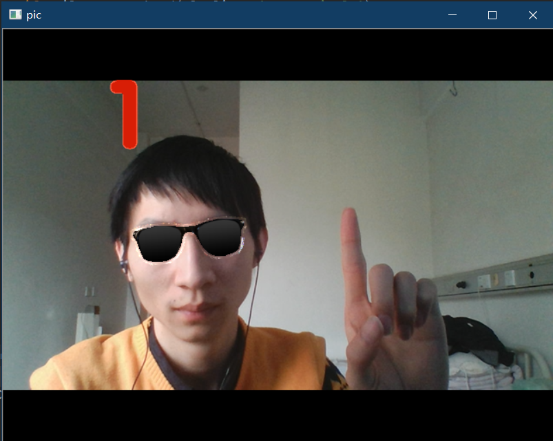

# 【百度大脑新品体验】手势识别

上次我尝试做了一个给眼镜加特效，针对的是静态图像，具体文章参考 https://ai.baidu.com/forum/topic/show/942890。

这次我尝试在视频中加眼镜特效，并且加上手势识别，不同的手势佩戴不同的眼镜。接下来将介绍手势识别接口，并介绍如何接入。

## 手势识别接口

### 接口描述

识别图片中的手势类型，返回手势名称、手势矩形框、概率分数，可识别24种常见手势，适用于手势特效、智能家居手势交互等场景。

支持的24类手势列表：拳头、OK、祈祷、作揖、作别、单手比心、点赞、Diss、我爱你、掌心向上、双手比心（3种）、数字（9种）、Rock、竖中指。

注：

* 上述24类以外的其他手势会划分到other类。
* 除识别手势外，若图像中检测到人脸，会同时返回人脸框位置。

----

人体分析的请求方式和人脸识别的请求方式有所不同，具体的使用说明参见文档 https://ai.baidu.com/docs#/Body-API/27495b11

### 请求格式

POST 方式调用，请求 URL 为 https://aip.baidubce.com/rest/2.0/image-classify/v1/gesture，`Content-Type` 为 `application/x-www-form-urlencoded`，然后通过 `urlencode` 格式化请求体。

### 请求参数

|参数|是否必选|类型|可选值范围|说明|
|:---:|:---:|:---:|:---:|:---|
|image|是|string|-|图像数据|

说明：图像数据为 Base64 编码字符串，以图片文件形式请求时必填。图片的 base64 编码是不包含图片头的，如（data:image/jpg;base64,），（支持图片格式：jpg，bmp，png），图片 Base64 编码后大小不超过 4M。最短边至少 50px，最长边最大 4096px。

### 返回说明

#### 返回参数

|字段|是否必选|类型|说明|
|:---:|:---:|:---:|:---|
|result_num|是|int|结果数量|
|result|是|object[]|检测到的目标，手势、人脸|
|+classname|否|string|目标所属类别，24种手势、other、face|
|+top|否|int|目标框上坐标|
|+width|否|int|目标框的宽|
|+left|否|int|目标框最左坐标|
|+height|否|int|目标框的高|
|+probability|否|float|目标属于该类别的概率|
|log_id|是|int64|唯一的log id，用于问题定位|

#### 返回示例

```json
{
        "log_id": 4466502370458351471,
    	"result_num": 2,
    	"result": [{
    		"probability": 0.9844077229499817,
    		"top": 20,
    		"height": 156,
    		"classname": "Face",
    		"width": 116,
    		"left": 173
    	},
    	{
    		"probability": 0.4679304957389832,
    		"top": 157,
    		"height": 106,
    		"classname": "Heart_2",
    		"width": 177,
    		"left": 183
    	}]
    }
```

## 实例

### 1. 创建应用

由于戴眼镜是使用的人脸识别的接口，手势识别是人体分析的接口，因此为了将手势识别应用到戴眼镜特效中，需要在创建人脸识别应用时勾选人体分析的手势识别。

首先进入“控制台”的“人脸识别”，然后“创建应用”。


然后填上“应用名称”和“应用描述”，并且接口勾选上“人体分析”下的“手势识别”。


之后点击“立即创建”，创建好之后我们就能够获取到应用的 “API key” 和 “Secret key”，用于后面获取 “token key”。

### 获取 token key

通过 `API Key` 和 `Secret Key` 获取的 `access_token`。更多关于 `access_token` 的获取方法参考 [http://ai.baidu.com/docs#/Auth/top](http://ai.baidu.com/docs#/Auth/top)。

下面代码是 python3 获取 access_token 的代码

```python
# 获取 token
def get_token_key():
    token_key = ''
    # client_id 为官网获取的AK， client_secret 为官网获取的SK
    client_id = '【百度云应用的AK】'
    client_secret = '【百度云应用的SK】'

    host = f'https://aip.baidubce.com/oauth/2.0/token?grant_type=client_credentials' \
        f'&client_id={client_id}&client_secret={client_secret}'

    request = Request(host)
    request.add_header('Content-Type', 'application/json; charset=UTF-8')
    response = urlopen(request)
    token_content = response.read()
    if token_content:
        token_info = json.loads(token_content)
        token_key = token_info['access_token']
    return token_key
```

### 调用手势识别接口

调用手势识别接口的 python3 代码实现如下：

```python
def get_hand_info(image_base64, token_key):
    request_url = "https://aip.baidubce.com/rest/2.0/image-classify/v1/gesture"
    params_d = dict()
    params_d['image'] = str(image_base64, encoding='utf-8')
    params = urlencode(params_d)
    access_token = token_key
    request_url = request_url + "?access_token=" + access_token
    res = requests.post(url=request_url,
                        data=params,
                        headers={'Content-Type': 'application/x-www-form-urlencoded'})
    data = res.json()
    return data
```

正确调用接口获取到数据之后，我们可以得到一些想要的信息。例如：获取检测的类别的数量、各个类别的类别名以及边框。

```python
def get_hand_num(data):
    return data['result_num']


def get_hand_cls_and_bbox(data):
    result = list()
    cls_list = list()
    hand_num = get_hand_num(data)
    for i in range(hand_num):
        res_dict = data['result'][i]
        cls = res_dict['classname']
        cls_list.append(cls)
        bbox = [res_dict['left'], res_dict['top'], res_dict['width'], res_dict['height']]
        res = [cls] + bbox
        result.append(res)
    return result, cls_list
```

## 案例代码与说明

整个案例的核心代码如下：(由于人脸识别的 QPS 为 2，因此在显示图像时使用了 `cv2.waitKey(500)`，所以真个应用看起来不是很流畅)

```python
import cv2
from util import pic_base64, get_face_info, get_face_location, get_face_num, frame2base64, get_hand_info
from pprint import pprint
import util
import face_util
import gesture_util
import os
import random

token_key = '【获取的 token key】'
glasses_img = ['images/glasses/'+img for img in os.listdir('images/glasses')]

glasses = cv2.imread('images/glasses/glasses6.png', cv2.IMREAD_UNCHANGED)


cap = cv2.VideoCapture(0)
while True:
    _, image = cap.read()
    detect_img = image.copy()
    gray = cv2.cvtColor(image, cv2.COLOR_BGR2GRAY)
    image_base64 = frame2base64(image)
    face_data = get_face_info(image_base64, token_key)
    hand_data = get_hand_info(image_base64, token_key)
    _, cls_list = util.get_hand_cls_and_bbox(hand_data)
    if face_data:
        location = get_face_location(face_data)
        face_num = util.get_face_num(face_data)
        landmark4 = util.get_landmark4(face_data)
        if util.compare_hand(cls_list, 'Heart_single'):
            detect_img = gesture_util.draw_heart_single(detect_img)
        if util.compare_hand(cls_list, 'Ok'):
            detect_img = gesture_util.draw_firework(detect_img)
        if util.compare_hand(cls_list, 'One'):
            glasses = cv2.imread(glasses_img[1], cv2.IMREAD_UNCHANGED)
            detect_img = gesture_util.draw_one(detect_img)
        if util.compare_hand(cls_list, 'Two'):
            glasses = cv2.imread(glasses_img[2], cv2.IMREAD_UNCHANGED)
            detect_img = gesture_util.draw_two(detect_img)
        if util.compare_hand(cls_list, 'Three'):
            glasses = cv2.imread(glasses_img[3], cv2.IMREAD_UNCHANGED)
            detect_img = gesture_util.draw_three(detect_img)
        if util.compare_hand(cls_list, 'Four'):
            glasses = cv2.imread(glasses_img[4], cv2.IMREAD_UNCHANGED)
            detect_img = gesture_util.draw_four(detect_img)
        if util.compare_hand(cls_list, 'Five'):
            glasses = cv2.imread(glasses_img[5], cv2.IMREAD_UNCHANGED)
            detect_img = gesture_util.draw_five(detect_img)
        if util.compare_hand(cls_list, 'Fist'):
            glasses = cv2.imread(glasses_img[random.randint(0, len(glasses_img)-1)], cv2.IMREAD_UNCHANGED)
        if util.compare_hand(cls_list, 'ILY'):
            detect_img = gesture_util.draw_love(detect_img)

        detect_img = face_util.wear_glasses(detect_img, glasses, face_num, landmark4)
        detect_img = cv2.flip(detect_img, 1)
    else:
        detect_img = cv2.flip(detect_img, 1)
    # for i, cls in enumerate(cls_list):
    #     if cls != 'Face':
    #         cv2.putText(detect_img, cls, (50, 50 + 100 * i), cv2.FONT_HERSHEY_SIMPLEX, 0.6, (0, 255, 255), 2)
    cv2.imshow('pic', detect_img)
    key = cv2.waitKey(500) & 0xFF
    if key == ord('q'):
        break
cap.release()
cv2.destroyAllWindows()

```

该代码主要识别数字1-5、比心、OK、单手我爱你和拳头手势，数字1-5对应不同类型的眼镜，拳头代表随机更换眼镜，比心会在界面上画出心❤，OK会在界面上展示一些烟花，单手我爱你展示爱你的表情。

下面是一些截图展示：

one：



two:


three: 


four:


five:


OK:


比心：


我爱你：


**项目代码地址：[https://github.com/busyboxs/baiduAIFace](https://github.com/busyboxs/baiduAIFace)**，修改好自己的 API key 和 Secret Key 之后直接执行 camera_face 即可。